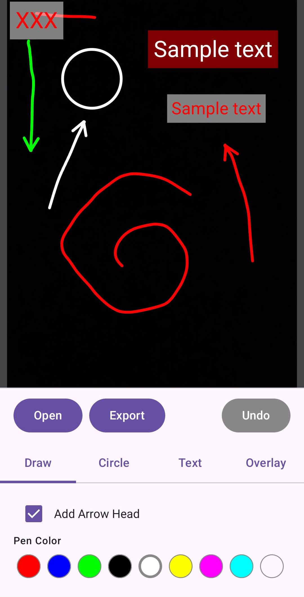

# DrawThings (Image Editor)

Jetpack Compose Android app that lets you pick an image and draw lightweight annotations on top (freehand pencil + hollow circles), then export the result to the device gallery.

> The functionality described here is based on `app/src/main/java/com/example/drawthings/ImageEditorScreen.kt`.

---

## Features

### Image import
- Tap **Open** to choose an image using `ActivityResultContracts.PickVisualMedia`.
- Reads **EXIF orientation** from the selected image and rotates the decoded bitmap when needed.
- Resets the current drawing actions when a new image is loaded.

### Drawing tools (on a Compose Canvas)
- **Pencil (Tool: `DRAW`)**
  - Drag to create a smooth freehand path.
  - Optional **Arrow Head** checkbox: draws an arrow head at the end of each stroke.
  - Stroke color selectable via a small palette.

- **Circle (Tool: `CIRCLE`)**
  - Drag from the initial touch point to set the radius.
  - Draws a **hollow** circle (stroke only).
  - Circle color selectable via a small palette.

### Overlays & styling
- **Overlay text** (labeled “Top-Left Overlay Number”): enter a single-line text shown at the top-left.
- **Border**:
  - Optional **Enable Border** checkbox.
  - Border color selectable.

### Undo
- **Undo** removes the last recorded drawing action (path or circle).

### Export to gallery
- **Export** renders the final annotated bitmap:
  - Starts with a copy of the original decoded bitmap.
  - Scales all strokes/overlays from the Compose canvas size to the native bitmap size.
  - Writes the output as `Edited_<timestamp>.png` into `Pictures/` using `MediaStore`.
- Shows a toast: **“Saved to Gallery!”**

---

## How it works (implementation notes)

- `ImageEditorScreen()` is the main composable.
- Drawing is represented as a list of actions:
  - `DrawAction.DrawPath`: stores `Path`, color, stroke width, whether it’s smoothed, optional arrow head, and the sampled touch points.
  - `DrawAction.HollowCircle`: stores center, radius, color, stroke width.
- Pointer interaction is handled via `Canvas(...).pointerInput(...)` + `detectDragGestures`.
  - During drag, a “live” shape (path/circle) is drawn.
  - On drag end, the final action is appended to `actions`.
- Export uses `exportImage(...)`:
  - Computes `scaleX`/`scaleY` from `nativeBitmap` size vs. `canvasSize`.
  - Applies scaling to paths using `android.graphics.Matrix`.
  - Draws border, text, and each stored action onto the bitmap.

---

## File reference

- **Main UI + export engine**: `app/src/main/java/com/example/drawthings/ImageEditorScreen.kt`
  - `ImageEditorScreen()` (Compose UI)
  - `ColorPickerRow()` (color palette UI)
  - `DrawScope.drawArrow()` (arrowhead rendering)
  - `exportImage(...)` (native rendering + MediaStore save)

---

## Run

This is an Android Studio / Gradle project.
1. Open the project in Android Studio.
2. Sync Gradle.
3. Run the app on an Android device/emulator.

